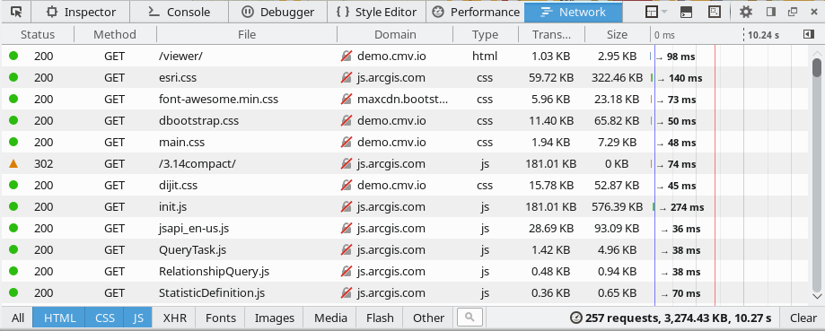
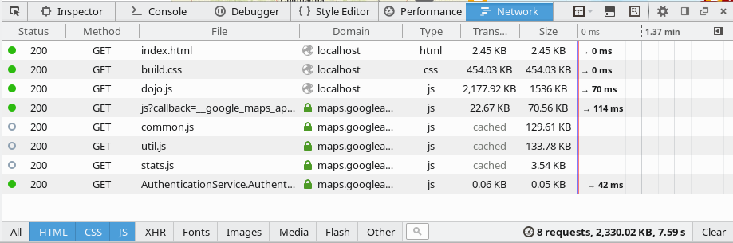

## What?

This branch is the esri-jsapi resource directory setup for creating single file dojo builds. It downloads dojo, the esri api, and CMV as bower resources and can be used to create high performance dojo builds using the dojo build system. The primary benefits are:

 * Smaller downloads: only the modules used in an application are downloaded
 * Quicker downloads: HTML and Javascript files are concatenated and optimized into single files using the closure compiler. CSS are concatenated using xstyle

See the difference! Note: the load times shown below are not observed in a production environment, and should not be used for comparison.

Instead, [Try The Demo](http://roemhildtg.github.io/cmv-app-dojo-builder/dist/) for an realistic comparison.

Before:

After:

# CMV - The Configurable Map Viewer

  

## Introduction

[CMV](http://cmv.io/) is a community-supported open source mapping framework. CMV works with the [Esri JavaScript API](http://docs.cmv.io/en/latest/developers.arcgis.com/javascript/jsapi/), [ArcGIS Server](http://www.esri.com/software/arcgis/arcgisserver), [ArcGIS Online](https://arcgis.com/) and more.

## Requirements
* [node & npm](https://nodejs.org/)
* [bower](http://bower.io/)
* [grunt](http://gruntjs.com/)
* [java 7 or greater](https://java.com/en/download/) - for [Closure Compiler](https://github.com/google/closure-compiler) used during build

## Usage
* `npm install -g bower` - installs bower
* `npm install -g grunt-cli` - installs global grunt
* `npm install` - installs required node and bower packages
* `npm run clean` - removes built files from `dist` directory
* `npm run build` - run the Dojo build on application and run the cleanup tasks which remove all js and css files
* `npm run build-dev` - run the Dojo build on application but leave all files. Useful for debugging builds

If you have [Python](https://www.python.org/) you can run `python -m SimpleHTTPServer` in same folder as application to run it in a browser.

## Customizing dojo layers

1. Use `build.profile.js`, `viewer.js`, and other config files to add your layers. The current setup uses one large layer, `dojo/dojo.js`.
2. Another option is to have one main layer `dojo/dojo.js` and several others like config files that are loaded on demand.
3. When adding layer files, both `build.profile.js` and `Gruntfile.js` clean task should be modified. Otherwise grunt will remove the file when it cleans up the build.

## Limitations

The dojo build system doesn't optimize packages between layers. Lets say you have 3 modules

 * Module A
 * Module B
 * Module C

1. Both A and B require C.
2. We create 2 layer files A and B.
3. Both layer files will have **their own** copy of C.

Maybe we should move away from dojo and use something like [StealJS](http://stealjs.com). What do you say, Esri?

##Troubleshooting

Instead of running grunt `dojo-build`, instead try running `build-viewer.sh`. This will give you a detailed error log in the dist directory called `build-report.txt`. Errors begin with error(123) in the output. These errors will most likely be paths that do not resolve correctly.

## Resources

* [Esri JSAPI Resources](https://github.com/Esri/jsapi-resources)
* [CMV](https://github.com/cmv/cmv-app)
* [The Dojo Build System](https://dojotoolkit.org/reference-guide/1.10/build/)
